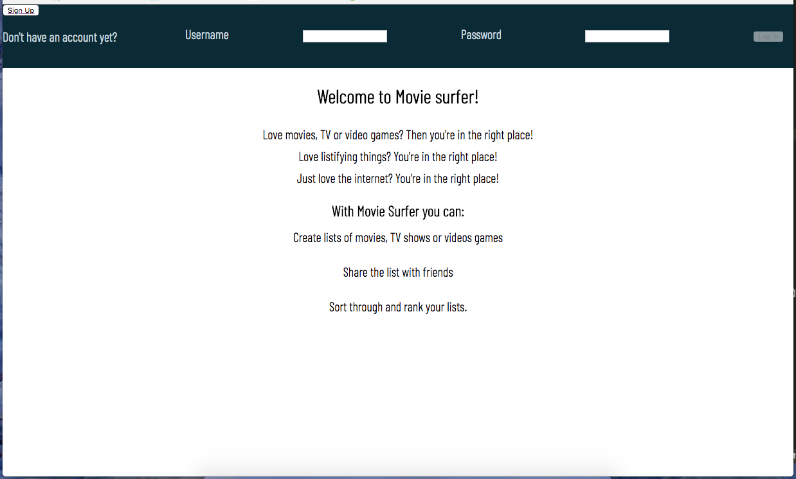
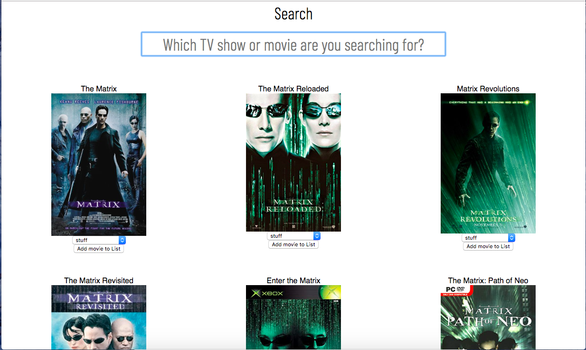

# Description of My app: 

My app is designed to let users search the IMDB database allow users 
to create lists of media such as TV shows, movies or video games. 

## Future development plans:
- Allow users to filter by genre when searching for movies.
- Allow users to search the movie database by Actor, Director and other meta-data.
- Allow users to sort and filter movies within lists by genre.

## Link to the live version:
https://james-moviesurfer-client.herokuapp.com/

## Screenshots of the app:

### Login:

### Search Results:

### List View:
